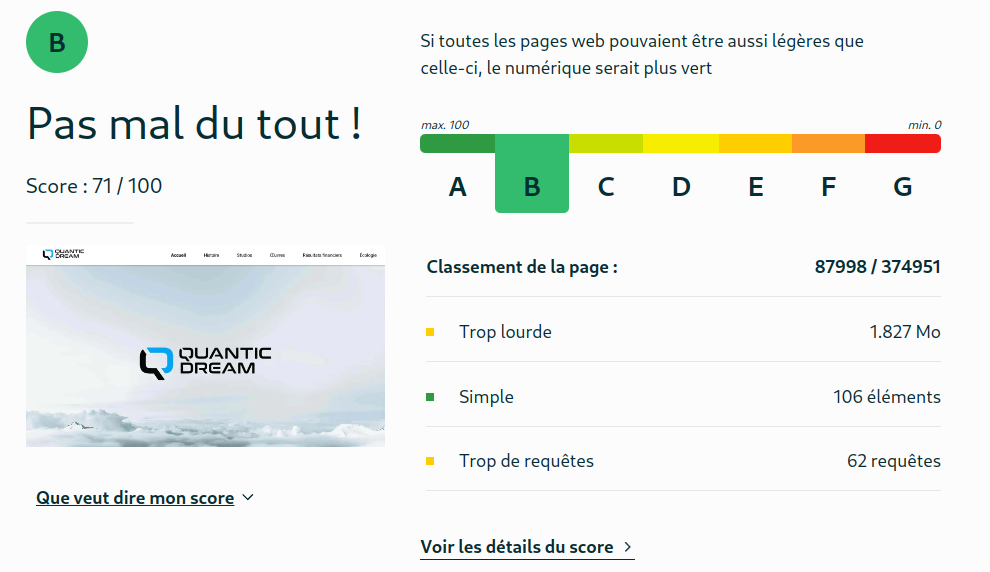
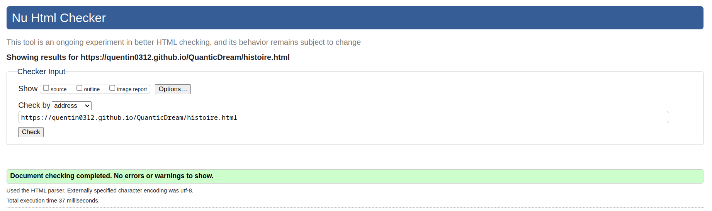

# Présentation de Quantic Dream

## Sujet

[Présentation de Quantic Dream](https://quentin0312.github.io/QuanticDream/)

## Membres du groupe :

Etudiant 1 (référent du groupe) : [OUADAH Kheira](mailto:kheira.ouadah@edu.univ-fcomte.fr?subject=SAE_1_05_06)  
Etudiant 2 : [OZBUDAK Suleyman](mailto:suleyman.ozbudak@edu.univ-fcomte.fr?subject=SAE_1_05_06)  
Etudiant 3 : [PAYET Quentin](mailto:quentin.payet02@edu.univ-fcomte.fr?subject=SAE_1_05_06)  
Etudiant 4 : [MOREL Gabin](mailto:gabien.morel@edu.univ-fcomte.fr?subject=SAE_1_05_06)  
Etudiant 5 : [RIETZ Ethan](mailto:ethan.rietz@edu.univ-fcomte.fr?subject=SAE_1_05_06)

## Présentation

Ce dépôt correspond à un site web créé en HTML/CSS/JS dans le cadre de la SAÉ 05-06 à l'IUT de Belfort. Ce site présente l'entreprise **Quantic Dream** et aborde :

- son histoire
- ses studios
- ses réalisations
- l'évolution de ses résultats financiers
- le message écologique transmis à travers le jeu Under The Waves.

Vous trouverez dans ce dépôt le code source du site développé.

## Choix de conception

TODO

## Développement Site Web et Validation des pages

### Page d'accueil

**Auteur : PAYET Quentin**

Vérification W3C : [Détail ICI](https://validator.w3.org/nu/?doc=https%3A%2F%2Fquentin0312.github.io%2FQuanticDream%2Findex.html)

### Page histoire

**Auteur : OUADAH Kheira**

Vérification W3C : [Détail ICI](https://validator.w3.org/nu/?doc=https%3A%2F%2Fquentin0312.github.io%2FQuanticDream%2Fhistoire.html)

### Page studios

**Auteur : PAYET Quentin**

Vérification W3C : [Détail ICI](https://validator.w3.org/nu/?doc=https%3A%2F%2Fquentin0312.github.io%2FQuanticDream%2Fstudios.html)

### Page oeuvres

**Auteur : PAYET Quentin**

Vérification W3C : [Détail ICI](https://validator.w3.org/nu/?doc=https%3A%2F%2Fquentin0312.github.io%2FQuanticDream%2Foeuvres.html)

### Page résultats financiers

**Auteur : RIETZ Ethan**

Vérification W3C : [Détail ICI](https://validator.w3.org/nu/?doc=https%3A%2F%2Fquentin0312.github.io%2FQuanticDream%2Feconomie.html)

### Page écologie

**Auteur : MOREL Gabin**

Vérification W3C : [Détail ICI](https://validator.w3.org/nu/?doc=https%3A%2F%2Fquentin0312.github.io%2FQuanticDream%2Fecologie.html)

